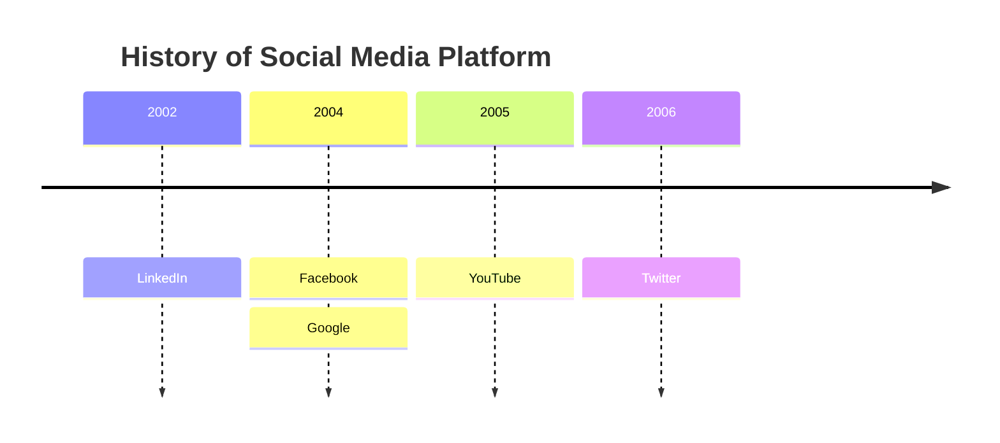
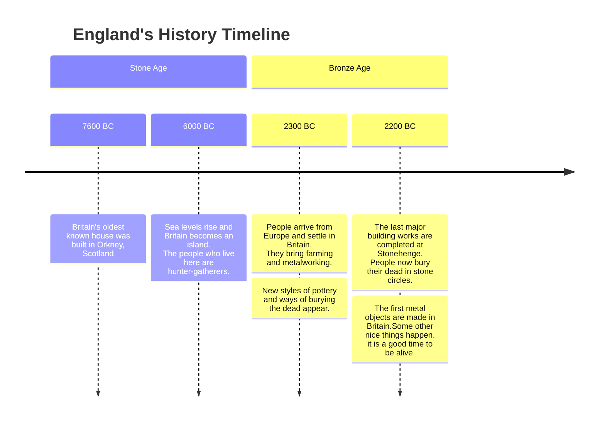

aaaa

**boldy**

*italici*

> [!note] Definicja
> definicja

> [!quote] Cytat
> cytat
> 


> [!tldr] Wzór
> wzór


> [!warning] Uwaga!
> oszczyżenię
> 

<mark style="background:#ff4d4f">zakreślenie</mark>
# test
aaa
## test
aaa
### test
aaa
#### test
aaa
##### test
aaa
###### test
aaa


```argdown
[Intelligent Design]:
The world seems intelligently designed. [God]: God exists. <Teleological proof> 
(1) [Intelligent Design] 
(2) [Best Explanation]: The best explanation for why the world seems intelligently designed (cf. @[Intelligent Design]), is that _there is_ an intelligent being designing it. 
----- 
(3) **Some** intelligent being designing the world exists. 
{sources: [ "Cleanthes" ]} 
(4) The only intelligent being that could [design the world](https://en.wikipedia.org/wiki/Intelligent_design) is God. #deism 
----- 
(5) [God]
```

```argdown
	(1) s1 
	(2) s2 
	---- 
	(3) s3
```


```argdown
[God]: There is a god. 
	+ <Teleological Proof>: Since the world is intelligently designed, there has to be an intelligent creator. 
	+  <Ontological Proof>: Whatever is contained in a clear and distinct idea of a thing must be predicated of that thing; but a clear and distinct idea of an absolutely perfect Being contains the idea of actual existence; therefore, since we have the idea of an absolutely perfect Being, such a Being must really exist.
```


```argdown 
[Statement]: this is a statement
    + pro one
	    - con 01
	    + dupa
    + pro 2
    - con 1
	    - con21
	    + pro 21
```



